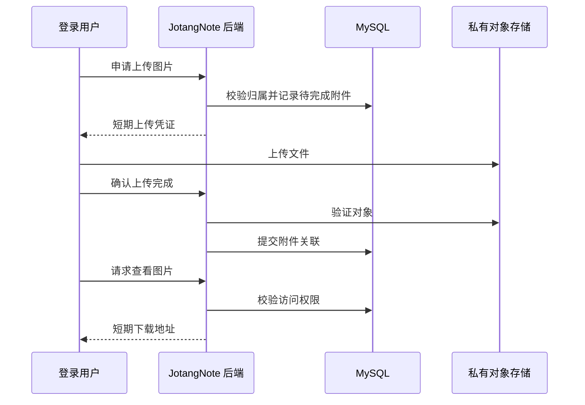

# 长文本与图片替代存储方案学习记录

本文对应入门篇 Part 1 的存储方案加分项：了解替代方案并记录学习内容。当前应用仍使用 MySQL 保存笔记正文，本文中的对象存储、图片上传和迁移流程是设计方案，尚未作为运行功能实现。

## 1. MySQL 能不能保存长文本和图片？

可以。MySQL 提供 TEXT 和 BLOB 等类型，不能把“并不擅长”理解成“不支持”。选择存储方式要结合内容大小、访问频率、备份成本和事务需求。大字段会增加传输和存储开销，列表查询也不应无条件带出全部正文；官方建议在性能敏感场景考虑把大字段放到独立表。[MySQL 大对象优化说明](https://dev.mysql.com/doc/refman/8.0/en/optimize-blob.html)

当前项目的 `notes.content` 是 TEXT。入门项目把元数据和正文一起存入 MySQL，能直接利用事务，开发和部署简单。随着正文和图片数量增加，再按实际测量结果选择拆分，不需要为了使用更多中间件而迁移。

## 2. 可选方案比较

下表是结合本项目需求作出的设计分析，不是已经完成的性能测试。

| 方案 | 数据放在哪里 | 适用情况 | 需要承担的代价 |
|---|---|---|---|
| MySQL 同表 | 标题、作者、正文在 notes | 当前学习项目，正文规模较小 | 查询列表时容易带出不需要的大正文 |
| MySQL 拆表 | notes 保存元数据，note_contents 保存正文 | 想减少列表查询负担，又需要数据库事务 | 详情查询需多查一次或关联查询 |
| MySQL + 对象存储 | MySQL 保存元数据和对象标识；正文文件、图片放对象存储 | 图片较多、正文体积较大，适合按对象读取 | 数据库与对象存储无法直接共用一个本地事务，需补偿与清理 |
| MySQL + 本地文件 | 文件在应用服务器磁盘，MySQL 保存文件标识 | 单机练习、部署环境简单 | 备份、扩容和多实例共享文件需要自己管理 |

## 3. 我为 JotangNote 选择的演进方向

优先保留 MySQL 正文，将图片放入私有对象存储；如果实测发现正文也造成明显开销，再将正文作为 UTF-8 Markdown 文件放入对象存储。MySQL 继续负责用户、笔记归属、标题、时间和文件引用。对象存储可以选 S3 或兼容其接口的服务，选型时另行验证所需 API 和部署条件。

建议的未来数据结构如下，不是当前已执行的数据库升级脚本：

```text
notes: id, author_id, title, content 或 content_key, content_revision, created_at, updated_at
note_assets: id, note_id, owner_id, object_key, mime_type, size_bytes, status, created_at
```

`object_key` 保存稳定的对象标识，例如 `notes/用户ID/笔记ID/随机ID.md`。不要保存会过期的下载 URL。每次修改写入新对象，再切换数据库引用，避免覆盖旧对象后数据库仍指向旧版本。正文中的图片引用附件 ID，由后端进行归属检查后提供访问地址。

## 4. 图片上传和访问流程设计

1. 登录用户向后端申请上传，后端校验笔记归属、文件类型和大小，并创建待完成的附件记录。
2. 后端生成随机对象 key，返回短期上传凭证；前端将文件传入私有对象存储。
3. 前端请求完成上传，后端检查对象是否存在、大小及实际内容类型是否符合限制，完成附件记录与笔记的关联。不能只相信用户提供的扩展名或 Content-Type。
4. 查看笔记时，后端先检查登录用户是否有权访问，再返回短期下载地址，或通过后端代理读取。

S3 预签名 URL 可以提供有期限的对象上传或下载权限。相同 key 的上传可以覆盖旧对象，所以随机 key、权限范围和凭证有效期都要纳入设计。拿到 URL 的人可能在有效期内使用它，私有笔记不能直接永久公开附件。[S3 预签名 URL 官方说明](https://docs.aws.amazon.com/AmazonS3/latest/userguide/using-presigned-url.html)



## 5. 两个存储之间的一致性

对象上传成功、数据库提交失败，会留下无人引用的对象。解决方向是在上传时建立待完成记录，只清理超过合理宽限时间、未被任何已提交记录引用的对象，不能刚上传就删除。

修改正文时，先上传新版本，再提交 MySQL 中的新对象引用；事务失败则保留旧引用，并将新对象纳入待清理范围。事务成功后失效对应 Redis 缓存，旧对象延迟清理，给并发读和恢复留出时间。

删除笔记时，可在同一数据库事务中记录待删除对象任务，再由后台任务删除对象。任务应允许重复执行，删除已经不存在的对象视作完成。对重要内容可保留版本和回收期，而不是立即永久删除。

## 6. 正文迁移与验证计划

如果未来采用对象存储正文，先增加 `content_key`，保留原 `content`。迁移程序读取正文、上传文件、验证内容校验值，再提交对象引用；新读取逻辑优先按引用读取，未迁移记录继续读数据库。迁移期间必须暂停相关写入，或通过版本条件更新防止旧正文覆盖新修改。完成备份和验证后，才考虑清理原正文。

建议验证：中文及 Markdown 往返一致；同一图片上传重试不产生错误关联；无权用户不能获取附件凭证；过期地址失效；对象上传成功但数据库失败时原笔记仍可读；删除对象失败后可重试；列表查询不加载正文文件。

本项交付是学习与方案记录，以上上传、迁移和异常场景尚未执行，因此不将它们写成“测试通过”。我对方案的理解是：MySQL 负责关系与事务，对象存储负责文件；拆分后必须主动处理权限、版本和跨存储失败，不能只在数据库里换成一个 URL 就算完成。
